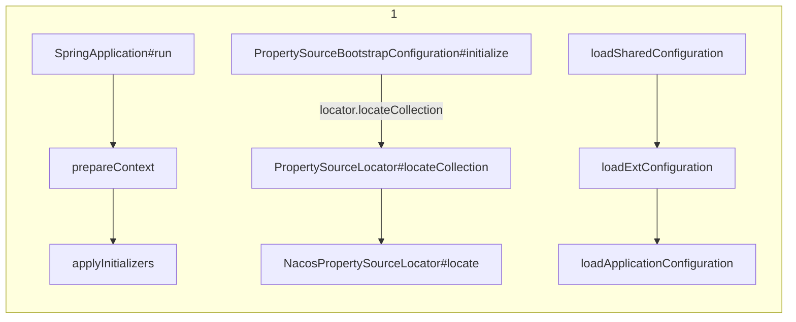
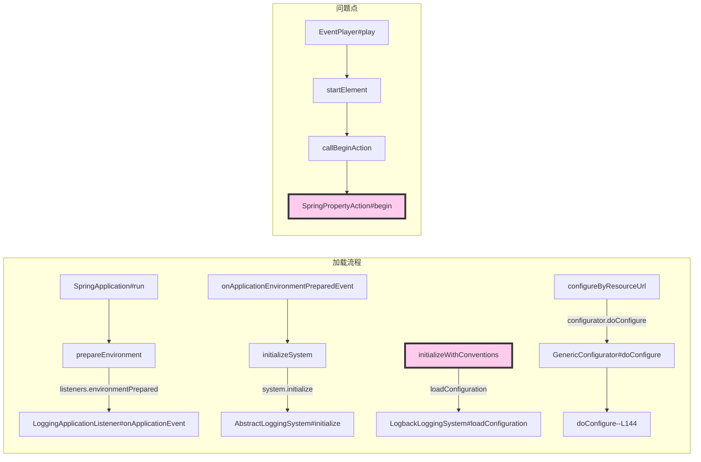

## Excel

#### Java读取Excel数值内容带.0或变科学计数法的解决办法

当excel里单元格的内容为纯数字 例如 '123'或 '12345678' 时，
读取后，会变成 123.0 或科学计数法。
一开始以为是单元格格式问题，发现把单元格改成文本类型也是如此。

网上其他诸如自己写方法进行转换 或者正则表达之类判断的方法，非常局限。

##### 简单的方式

```
Row row = sheet.getRow(i);
row.getCell(j).setCellType(CellType.STRING); //读取前将单元格设置为文本类型读取
```

记得可能会报`npe`
所以加个判空条件

```
Row row = sheet.getRow(i);
if(valueRow.getCell(j) != null){
    valueRow.getCell(j).setCellType(CellType.STRING);
}
```


### MVN

| mvn -v        | --version 显示版本信息;                                      |
| ------------- | ------------------------------------------------------------ |
| mvn -V        | --show-version 显示版本信息后继续执行Maven其他目标;          |
| mvn -h        | --help 显示帮助信息;                                         |
| mvn -e        | --errors 控制Maven的日志级别,产生执行错误相关消息;           |
| mvn -X        | --debug 控制Maven的日志级别,产生执行调试信息;                |
| mvn -q        | --quiet 控制Maven的日志级别,仅仅显示错误;                    |
| mvn -Pxxx     | 激活 id 为 xxx的profile (如有多个，用逗号隔开);              |
| mvn -Dxxx=yyy | 指定Java全局属性;                                            |
| mvn -o        | --offline 运行offline模式,不联网更新依赖;                    |
| mvn -N        | --non-recursive 仅在当前[项目](http://www.07net01.com/tags-项目-0.html)模块执行命令,不构建子模块; |
| mvn -pl       | --module_name 在指定模块上执行命令;                          |
| mvn -ff       | --fail-fast 遇到构建失败就直接退出;                          |
| mvn -fn       | --fail-never 无论项目结果如何,构建从不失败;                  |
| mvn -fae      | --fail-at-end 仅影响构建结果,允许不受影响的构建继续;         |
| mvn -C        | --strict-checksums 如果校验码不匹配的话,构建失败;            |
| mvn -c        | --lax-checksums 如果校验码不匹配的话,产生告警;               |
| mvn -U        | 强制更新snapshot类型的插件或依赖库(否则maven一天只会更新一次snapshot依赖); |
| mvn -npu      | --no-plugin-s 对任何相关的注册插件,不进行最新检查(使用该选项使Maven表现出稳定行为，该稳定行为基于本地仓库当前可用的所有插件版本); |
| mvn -cpu      | --check-plugin-updates 对任何相关的注册插件,强制进行最新检查(即使项目POM里明确规定了Maven插件版本,还是会强制更新); |
| mvn -up       | --update-plugins [mvn -cpu]的同义词;                         |
| mvn -B        | --batch-mode 在非交互（批处理）模式下运行(该模式下,当Mven需要输入时,它不会停下来接受用户的输入,而是使用合理的默认值); |
| mvn -f        | --file <file> 强制使用备用的POM文件;                         |
| mvn -s        | --settings <arg> 用户配置文件的备用路径;                     |
| mvn -gs       | --global-settings <file> 全局配置文件的备用路径;             |
| mvn -emp      | --encrypt-master-password <password> 加密主安全密码,存储到Maven settings文件里; |
| mvn -ep       | --encrypt-password <password> 加密服务器密码,存储到Maven settings文件里; |
| mvn -npr      | --no-plugin-registry 对插件版本不使用~/.m2/plugin-registry.xml(插件注册表)里的配置; |


## 静态类初始化失败

### 问题

>  `AServiceImpl` (正常的业务bean)内部用到`AUtils`(使用内部的静态方法)工具类。
>
>  在调用`AServiceImpl` 类的方法时，抛出异常：
>
>  ``` java
>  java.lang.NoClassDefFoundError
>  Could not initialize class com.****.AUtils
>  ....
>  ```
>
>  检查代码发现，在`AUtils`内部有一个静态变量的初始化
>
>  ```java 
>  private static final String a = BUtils.get();
>  ```
>
>  其中 `BUtils.get()`也是静态方法，追踪内部实现，发现有块代码有NPE的问题，静态方法内部也没有try处理。
>
>  网上查阅： JVM在加载类的时候，会初始化类里的静态变量，或执行静态块，如果这个时候抛出了异常，该类就会加载失败，那么以后任何使用到这个类的地方，都会抛出`NoClassDefFoundError`异常。
>
>  [see](https://blog.csdn.net/chen2526264/article/details/80534239)
>
>  后面处理掉NPE问题，上述异常也就解决了。


## `websocket wss` -`nginx`

```xml
#websocket --wss 
server {
        listen       9539 ssl;
        server_name  currentOSIP;

        ssl_certificate      /opt/dsst/https/selfSignCert/server.crt;
        ssl_certificate_key  /opt/dsst/https/selfSignCert/server.key;
        #add_header Strict-Transport-Security "max-age=172800; includeSubDomains";
        ssl_session_timeout 5m;
        ssl_ciphers ECDHE-RSA-AES128-GCM-SHA256:ECDHE:ECDH:AES:HIGH:!NULL:!aNULL:!MD5:!ADH:!RC4;
		#ssl_ciphers ALL:!ADH:!EXPORT56:RC4 RSA: HIGH: MEDIUM: LOW: SSLv2: EXP;
        ssl_protocols SSLv3 SSLv2 TLSv1 TLSv1.1 TLSv1.2;
        ssl_prefer_server_ciphers on;

        location / {
           proxy_pass http://currentOSIP:9538/;
		   proxy_connect_timeout 40s;                
           proxy_read_timeout 60s;                  
           proxy_send_timeout 120s;           
           proxy_http_version 1.1;
           proxy_set_header Upgrade $http_upgrade;
           proxy_set_header Connection "upgrade";
        }

}
```


##  `springboot` 日志配置问题导致的项目启动失败

日志级别由低到高： trace < debug < info < warm < error ，设置的级别越低显示的日志级别的信息越多。
例如：如果设置的日志级别是info,那么此时，低于info级别的trace，debug日志不会显示。

原先的日志配置：

```properties
logging.file = XXXXX.log
```

后面走`nacos`配置中心...

接下来开发功能，依赖其他组件，其他组件中有`logback-spring.xml`的配置，内部部分配置：

```xml
<file>${LOG_FILE}/${APP_NAME}-info.log</file>
...
<file>${LOG_FILE}/${APP_NAME}-error.log</file>
```

启动报错：

```properties
Caused by: java.lang.IllegalStateException: Logback configuration error detected: 
ERROR in ch.qos.logback.core.rolling.RollingFileAppender[ERROR] - openFile(./logs/security.log/smart-safety-error.log,true) call failed. java.io.FileNotFoundException: ./logs/security.log/smart-safety-error.log (不是目录)
ERROR in ch.qos.logback.core.rolling.RollingFileAppender[INFO] - openFile(./logs/security.log/smart-safety-info.log,true) call failed. java.io.FileNotFoundException: ./logs/security.log/smart-safety-info.log (不是目录)
	at org.springframework.boot.logging.logback.LogbackLoggingSystem.loadConfiguration(LogbackLoggingSystem.java:169)
	at org.springframework.boot.logging.AbstractLoggingSystem.initializeWithConventions(AbstractLoggingSystem.java:80)
	at org.springframework.boot.logging.AbstractLoggingSystem.initialize(AbstractLoggingSystem.java:60)
	at org.springframework.boot.logging.logback.LogbackLoggingSystem.initialize(LogbackLoggingSystem.java:118)
	at org.springframework.boot.context.logging.LoggingApplicationListener.initializeSystem(LoggingApplicationListener.java:313)
	at org.springframework.boot.context.logging.LoggingApplicationListener.initialize(LoggingApplicationListener.java:288)
	at org.springframework.boot.context.logging.LoggingApplicationListener.onApplicationEnvironmentPreparedEvent(LoggingApplicationListener.java:246)
	at org.springframework.boot.context.logging.LoggingApplicationListener.onApplicationEvent(LoggingApplicationListener.java:223)
	at org.springframework.context.event.SimpleApplicationEventMulticaster.doInvokeListener(SimpleApplicationEventMulticaster.java:172)
	at org.springframework.context.event.SimpleApplicationEventMulticaster.invokeListener(SimpleApplicationEventMulticaster.java:165)
	at org.springframework.context.event.SimpleApplicationEventMulticaster.multicastEvent(SimpleApplicationEventMulticaster.java:139)
	at org.springframework.context.event.SimpleApplicationEventMulticaster.multicastEvent(SimpleApplicationEventMulticaster.java:127)
	at org.springframework.boot.context.event.EventPublishingRunListener.environmentPrepared(EventPublishingRunListener.java:76)
	at org.springframework.boot.SpringApplicationRunListeners.environmentPrepared(SpringApplicationRunListeners.java:53)
	at org.springframework.boot.SpringApplication.prepareEnvironment(SpringApplication.java:345)
	at org.springframework.boot.SpringApplication.run(SpringApplication.java:308)
	at org.springframework.boot.SpringApplication.run(SpringApplication.java:1226)
	at org.springframework.boot.SpringApplication.run(SpringApplication.java:1215)
	at com.dahuatech.smc.SafetyApplication.main(SafetyApplication.java:29)

```


分析：

先分析`nacos`的配置原理：



> `nacos` 配置原理利用`springboot`环境上下文的获取顺序。`org.springframework.core.env.ConfigurableEnvironment#getPropertySources`。
>
> ```java
> private final List<PropertySource<?>> propertySourceList = new CopyOnWriteArrayList<>();
> ```
>
> 内部是有序的列表。`nacos`就是把自己的配置文件的内容解析成`PropertySource`并添加到`propertySourceList`的最前面 `addFirst`。实现了注册中心的功能。

该异常和`nacos`墨关系！！！ 

定位到异常位置：`LogbackLoggingSystem`.....

先看日志上下文的加载流程：



最终在 `org.springframework.boot.logging.logback.SpringPropertyAction#begin`找到问题所在。

这段内容是给日志上下文配置环境变量的，比如内部的`${LOG_FILE},${APP_NAME}`等。

其中`${LOG_FILE}`的默认值是  `/log/${APP_NAME}`。

而`${LOG_FILE}`的属性值得来源是 `logging.file`。我们原先的日志配置中正好有这属性，而且是带.log后缀的，所以在引入新的jar(包含`logback-spring.xml`)后，就会出现上述错误。

在看`springboot`的日志配置文件`org.springframework.boot.context.logging.LoggingApplicationListener#LOG_FILE_BEAN_NAME`

`org.springframework.boot.logging.LogFile`

```java
	@Deprecated
	public static final String FILE_PROPERTY = "logging.file";

	/**
	 * @deprecated since 2.2.0 in favor of {@link #FILE_PATH_PROPERTY}
	 */
	@Deprecated
	public static final String PATH_PROPERTY = "logging.path";

	/**
	 * @since 2.2.0
	 */
	public static final String FILE_NAME_PROPERTY = "logging.file.name";

	/**
	 * @since 2.2.0
	 */
	public static final String FILE_PATH_PROPERTY = "logging.file.path";
```

从springboot2.2版本开始，就修改了日志配置方式。

上述bug修改方式：

* 修改配置为 `logging.file = XXXXX` 可以按照引入jar包中`logback-spring.xml`中的配置方式处理日志。
* 修改配置为 `logging.file.path=XXXXX.log` 指定自己的处理方式。


## `SpringBoot`编程思想

### `springframework` 知识点

* xml方式的component-scan

  > `org\springframework\spring-context\5.2.7.RELEASE\spring-context-5.2.7.RELEASE.jar!\META-INF\spring.handlers`

​       `org.springframework.context.config.ContextNamespaceHandler`	

```java
@Override
	public void init() {
		...
		registerBeanDefinitionParser("component-scan", new ComponentScanBeanDefinitionParser());
		...
	}
```


> `org.springframework.context.annotation.ClassPathScanningCandidateComponentProvider#scanCandidateComponents` 扫描的入口。
>
> `ClassPathScanningCandidateComponentProvider`构造的时候默认添加了注解扫描的条件`org.springframework.context.annotation.ClassPathScanningCandidateComponentProvider#registerDefaultFilters`
>
> 注解的识别：`AnnotationTypeFilter`
>
> ```java 
> this.includeFilters.add(new AnnotationTypeFilter(Component.class));
> ...
> ```

> 上述逻辑中发现，可以通过继承`ClassPathScanningCandidateComponentProvider`实现自定义的扫描逻辑。只要在扫描注册之前，把自己的过滤规则添加到`IncludeFilter`即可。
>
> 比如Dubbo的@Service，`OpenFeign`的`@FeignClient`(`org.springframework.cloud.openfeign.FeignClientsRegistrar#registerFeignClients`)等。


* 类加载
  * Java中，Class对象是类的元信息的载体，包含字段，方法，注解，构造等信息。Class是通过`ClassLoad`加载的。
  * Spring中是通过ASM实现的，如`org.springframework.asm.ClassReader`。
  * Spring通过抽象出`org.springframework.core.type.classreading.MetadataReader`获取类的元信息。
